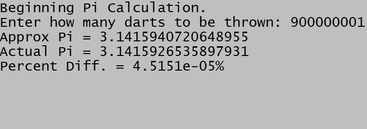
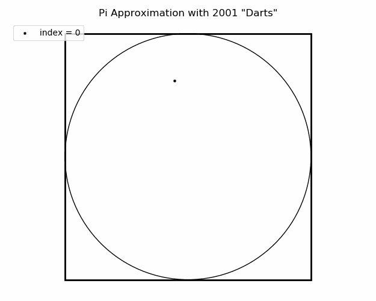

## Pi Approximation Using Darts
Given a circle inscribed in a square (see image below), if darts are randomly thrown at this "board", most will land in the circle, and some will land in the small region that the circle does not cover. Given the area of the circle is pi * radius^2, and the area of the square (whose side length would be 2 * radius if a circle is inscribed within it)is 4 * radius^2, the probability of a dart landing within the circle is pi * radius^2 / 4 * radius^2 = pi/4. Multiplying by 4, we can find the approximate value of pi. With only a few darts thrown, the approximation for pi would not be very close to the actual value. But after many darts are thrown, the value will get closer and closer.

# Code
My codes simulates throwing darts by generating x and y coordinates within the area of the square. I have two versions: one is written in C++ and the other in Python. The C++ version allows the user to input how many darts to be thrown (the more darts the more likely the value will be close to the actual value of pi, but the longer the computations will take and more taxing it will be on the computer). The Python version has the number of darts to be thrown built into the code, but it also runs through the whole process multiple times, only displaying the best value at the end of the process.

Note: When choosing the number of darts, it is best to choose a value not ending in 0 to show a higher number of non-zero decimals.

# Output
The C++ output is seen below. It provides the approximated pi value, the actual value of pi, and the (absolute) percent difference between the two values. (The Python code outputs the same in addition to the difference between the two values and how many iterations were done).

# Image of "Dart Board"
Below is an image representing what is happening. This was only done with 200001 "darts" because more darts would eventually fill the board with one color.

Here is an animation of the "darts" being "thrown". This was only done for 2001 "darts" because of how long it takes to process the animation.

